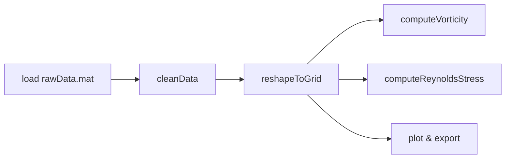

# PIVPostLab

PIVPostLab は MATLAB 用の PIV 後処理ツールです. 初版では CUI (コマンドライン) での操作に特化し, X,Y,U,V,相関係数 など PIV ソフトウェアが出力するベクトル場を読み込んで, 渦度,レイノルズ応力,乱流強度,可視化画像 を一括で生成します.

> **将来の GUI 対応について**
> コア処理は関数とクラスに完全分離して実装しているため, 後から App Designer で GUI を追加するのは比較的容易です. 詳細は「設計方針」と「ロードマップ」を参照してください.

## 特長

* 純 CUI で高速バッチ解析.
* 渦度,レイノルズ応力,乱流強度 など統計量を自動計算.
* ベクトルオーバーレイ, 渦度カラーマップ, ストリームライン の PNG / TIFF 出力.
* スクリプト 1 行で複数ファイルを処理可能.

## 動作環境

* MATLAB R2021b 以降.
* 必要 Toolbox: none (Image Processing Toolbox があると可視化が高品質になります).

## インストール

```bash
# HTTPS
$ git clone https://github.com/yourname/PIVPostLab.git
# または ZIP をダウンロードして展開
```

MATLAB で

```matlab
addpath(genpath('PIVPostLab'));
```

## 使い方 (最小例)

```matlab
% 1. データ読込み (CSV 例)
data = readmatrix('piv_output.csv');
X = data(:,1); Y = data(:,2);
U = data(:,3); V = data(:,4);
cc = data(:,5);    % 相関係数

% 2. 解析
results = pivpostlab.computeAll(X,Y,U,V,'cc',cc);

% 3. 可視化
pivpostlab.plotVectorOverlay(results);
pivpostlab.saveFigure('vec_overlay.png');
```

詳しい API は `docs/API.md` を参照してください.

## フォルダ構成

```
PIVPostLab/
 ├─ src/            % 核となるクラス & 関数
 │   ├─ +pivpostlab/    % 名前空間フォルダ
 │   │   ├─ computeAll.m
 │   │   ├─ vorticity.m
 │   │   ├─ reynoldsStress.m
 │   │   └─ ...
 │   └─ cli/            % CUI ラッパースクリプト
 ├─ examples/       % サンプルデータ
 └─ docs/           % ドキュメント
```

## 設計方針

1. **計算ロジックとインタフェースの分離**

   * `+pivpostlab` 名前空間下に純粋関数とクラスを配置.
   * CUI は `cli/` 内の薄いラッパースクリプトのみ.
2. **面倒な依存を排除**

   * 標準 MATLAB だけで動作. オプションで Image Processing Toolbox.
3. **GUI 拡張を見据えた API**

   * 将来 App Designer で `pivpostlabApp.mlapp` を追加予定.

## 解析パイプライン


## ロードマップ

| フェーズ | 内容                             |
| ---- | ------------------------------ |
| v0.1 | CUI 版 基本統計量 & 可視化 (本リリース)      |
| v0.2 | バッチ処理, MEX オプションで高速化           |
| v0.3 | App Designer GUI, 解析パラメータプリセット |

## ライセンス

MIT License.

## 引用

```
Koshiba T., PIVPostLab: MATLAB PIV Post‑Processing CLI, 2025, GitHub repository.
```
